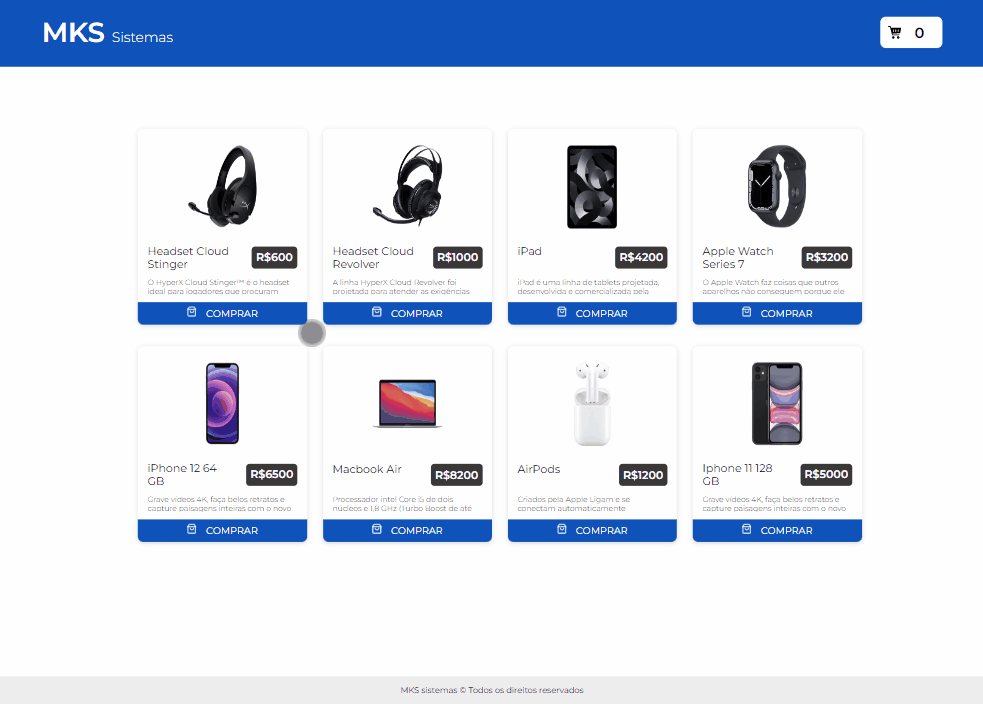
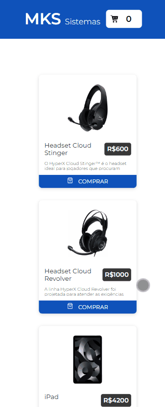

<h1 align="center">MKS-sistemas</h1>

Esse é um projeto desenvolvido em processo seletivo consumindo uma API Rest

 <a href="#características">Características</a> •
 <a href="#tecnologias">Tecnologias</a> •
 <a href="#instalação">Instalação</a>

### Características

  <h1 align="center">Site de compras com sistema de carrinhos Desktop</h1>
  

  <h1 align="center">Site de compras com sistema de carrinhos Mobile</h1>
  

### Tecnologias

As seguintes ferramentas foram usadas na construção do projeto:

- [Vite](https://vitejs.dev/)
- [Node](https://nodejs.org/en/)
- [React](https://pt-br.reactjs.org/)
- [Typescript](https://www.typescriptlang.org/)
- [Yarn](https://www.npmjs.com/package/yarn)

### Instalação

Para executar o projeto em sua maquina é necessário instalação do [yarn](https://www.npmjs.com/package/yarn)

comando: npm i yarn

Após instalação do yarn rode os comandos respectivamente em sua maquina:

comando 1: yarn 
comando 2: yarn dev

Veja a execução do site em: localhost:3000
